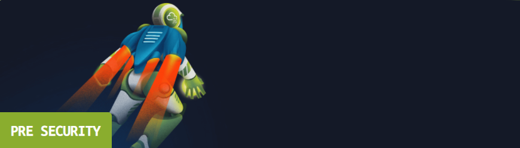

    

## Introduction

[TryHackMe](https://tryhackme.com) recently released the fully developed version of their "[Pre-Security Path](https://tryhackme.com/path/outline/presecurity)". To celebrate, they've been running this "ticket" event (similar to the Monopoly events at fast-food chains and/or grocery stores) with ~$5,000 available in prizes. They're also asking people to review the path, which is definitely not a coincidence with me starting this blog.

## Act 1: But What is TryHackMe?

[TryHackMe](https://tryhackme.com) is a site that seeks to teach cybersecurity concepts by gameifying them. Rather than have a bunch of lectures that you listen to and take notes on, TryHackMe sets up "rooms" with different tasks to complete, most of which involve some kind of hands-on application. The site is community-driven, meaning anyone can make a room and contribute to the ever-growing catalog of topics (as long as you pass peer-review).

Now, I had already been using TryHackMe as a way to self-learn some of the concepts that I hadn't gotten to yet in university. I was brought in after hearing about their "[Advent of Cyber 2](https://tryhackme.com/room/adventofcyber2)" event, which was an advent calendar style series of tasks, intended to act as a "sampler" of what the infosec field had to offer. However, one of the biggest hurdles I encountered afterward was my lack of a solid CS foundation. I had been going to school for a semester at this point, but I was still trying to get general education requirements out of the way (*\*ahem\** "liberal arts school" *\*ahem\**). 
Eventually, I learned the basics of networking on my own and with TryHackMe, but at the time, it certainly hurt my ability to comprehend concepts fully. What *is* a port, really? Why are we using Linux? Who cares about the OSI model?

## Act 2: Introducing the Pre-Security Path

    

TL;DR: I honestly wish the pre-security path had come sooner.

The [Pre-Security Path](https://tryhackme.com/path/outline/presecurity) assumes you have basic computing knowledge (and by that I mean you know how to use a computer) and takes you from ground-zero, to having the foundational knowledge needed to begin learning about security. The course outline is as follows:

    

- Cyber Security Introduction
    - Learning Cyber Security
- Network Fundamentals
    - What is Networking?
    - Intro to LAN?
    - OSI Model
    - Packets and Frames
    - Extending Your Network
- How the Web Works
    - DNS in Detail
    - HTTP in Detail
    - How the Web Works
    - Putting it All Together
- Linux Fundamentals
    - Linux Fundamentals Part 1
    - Linux Fundamentals Part 2
    - Linux Fundamentals Part 3
- Windows Fundamentals
    - Windows Fundamentals Part 1
    - Windows Fundamentals Part 2

While each room is pretty well designed in its own right, I will briefly touch on each of the modules, excluding the introduction, and then give my thoughts on the end.

## Act 3: Networking (not the LinkedIn kind)

This module takes you from understanding what a network is, introduces you to what framework has been set up to codify networking, and describes the function of networks *practically*. I've always struggled to remember and understand the purpose of each of the layers in the OSI model, and this section really hammers some of the main points home. Obviously, if you're a Network Administrator/Engineer, this is probably a pretty surface level look at what goes on. But, if you're just getting into security, this is a good base of information to build off of. One of my favorite bits was this OSI Dungeon game:

    

Another interactive demo that was especially helpful for someone like me to review was the network topologies viewer:

    

Being able to visually see any sort of model is a very useful way to make sure things stick.

## Act 4: 🎵 *We're Surfing on the Internet* 🎵

The Web module covers DNS, HTTP, basic web development, and put those concepts together. Like the network module, it also uses interactive demos to illustrate certain concept. While I personally would have liked to use a real command line to get results, I think having a prebuilt setup is less intimidating to those who aren't as comfortable with getting in the thick of things. I think one of the most effective lessons from this module is the final "Putting it All Together Room", which lightly touches on almost everything you've covered thus far in the course. Not only do you revisit some of the concepts from the web-related rooms, but it also makes you think about how networks play into it.

    

## Act 5: Noot Noot!

I think learning Linux on my own (before this released), was one of the more difficult parts of getting better at security for me. My (limited) programming experience had been exclusively on a Windows host, and breaking away from a GUI and using a command line was jarring at first. I completed the original Linux Fundamentals Rooms on TryHackMe before they were re-released, and then re-released again, but it still took me a while to really understand anything.
The newly redesigned rooms are VERY beginner friendly, and appropriately hold your hand through each new concept. I especially enjoyed the addition of the split screen machine, and then telling you to learn to use `ssh`. It's very nicely progressed, and while I did think the ctf placed at the end of the original rooms was cool, I think removing it for now is very good.

    

## Act 6: Windows

The Windows Fundamentals rooms begin by introducing the main components of the Windows GUI, and then proceeds to get into the nitty gritty parts of things like the registry and UAC controls. While I think it does cover the important stuff associate with Windows, it feels slightly incomplete in certain areas. There is also an Intro To Windows room that's located in the "Complete Beginner" path that I feel belongs in the pre-security path as well, so hopefully it gets the additions that it needs. 
Furthermore, I think a section should be dedicated to navigating Windows' `cmd.exe`, because even now I forget that `dir` is what gets used instead of `ls`. I would also say that Powershell should be added, but that gets a little complicated and I've seen the room on that already.

## Act 7: Closing Thoughts

For a mostly free course, this is pretty much exactly what I was looking for back in December 2020. It hits just the right balance between holding your hand and making you work for it, and covers the essential topic neccessary to go onward with learning cybersecurity. Additionally, the cost to subscribe is about the cost of a big dumpling, which isn't very much considering how much more content you're getting. I will almost certainly be recommending this path and site for anybody I know who wants to start learning more.
Obviously, some areas are less fleshed out than others, but I think, holistically, it's very well put together. 

If you've made it this far, thank you for reading <3. If you're the TryHackMe rep that's reading this to award me tickets, I hope this was of some level of quality for you. This "challenge", for lack of better words, has motivated me to start putting out writeups, and revise some of the concepts I may have forgotten.

If you're looking for more things to do on the site, here you go!:  
**The Official Unoffical Free Path**: https://blog.tryhackme.com/free_path/  
**Offensive Pentesting**: https://tryhackme.com/path/outline/pentesting  
**Cyber Defense**: https://tryhackme.com/path/outline/blueteam  
